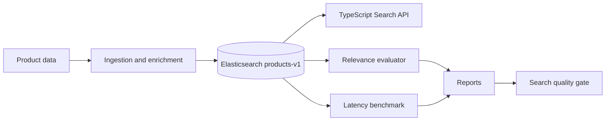

# Elastic Product Search Relevance Lab

This project demonstrates a measurable e-commerce search evaluation workflow with Elasticsearch. It compares product mappings, deterministic ingestion, `search_profile` enrichment, BM25 search strategies, judgment-list relevance metrics, latency benchmarks, and local quality gates that compare relevance and performance together.

## Why This Exists

Product search relevance is not guesswork. Search changes should be evaluated with judgment lists and metrics, not only with a few manual queries that look good. This lab shows how ingestion quality affects search quality by enriching product documents before indexing, then comparing baseline and improved strategies with Precision@5, MRR@10, nDCG@10, and p95 latency. The goal is to make the trade-off visible: a search strategy can improve relevance and still be a poor choice if tail latency gets too expensive.

## What It Demonstrates

- [x] Elasticsearch product mapping
- [x] Deterministic ingestion with product IDs as document IDs
- [x] `search_profile` enrichment from product fields
- [x] BM25 and boosted search strategies
- [x] Judgment-list relevance evaluation
- [x] Latency benchmarking with p50/p95/p99
- [x] CI checks plus local search quality gates
- [x] JSON and Markdown reports for review
- [x] Read-only MCP server exposing the search core as agent tools

## Architecture



## Run Locally

Start Elasticsearch and Kibana:

```powershell
docker compose up -d
```

Local Elasticsearch security is enabled. Use the built-in `elastic` superuser for Elasticsearch and Kibana login; the password lives only in your ignored local `.env` file. Do not commit real passwords.

Install Python dependencies:

```powershell
.\.venv\Scripts\python.exe -m pip install -e .
```

Create the index and load the sample catalog:

```powershell
.\.venv\Scripts\python.exe scripts\create_index.py --recreate
.\.venv\Scripts\python.exe scripts\load_sample_data.py
```

Start the API:

```powershell
cd apps/api
npm install
npm run dev
```

Run a search from another terminal:

```powershell
curl "http://localhost:3000/search?q=wireless%20mouse&availability=in_stock&debug=true"
```

Run relevance evaluation, latency benchmark, and the quality gate:

```powershell
cd ..\..
npm run evaluate:relevance
npm run benchmark:search
npm run gate:search-quality
```

Optional full ESCI local workflow:

```powershell
.\.venv\Scripts\python.exe -m pip install -e ".[esci]"
.\.venv\Scripts\python.exe scripts\prepare_esci_sample.py `
  --products data\raw\esci\shopping_queries_dataset_products.parquet `
  --examples data\raw\esci\shopping_queries_dataset_examples.parquet `
  --full
.\.venv\Scripts\python.exe scripts\create_index.py --recreate
.\.venv\Scripts\python.exe scripts\load_sample_data.py `
  --input data\generated\esci_full_products.jsonl `
  --batch-size 500
npm run evaluate:relevance:esci
npm run benchmark:search:esci
npm run gate:search-quality:esci
```

The full ESCI raw files and generated JSONL files stay local under ignored `data/raw/` and `data/generated/` paths.

## Example Results

The table below uses the local 100-query ESCI subset reports in `reports/esci-relevance-report.md` and `reports/esci-latency-report.md`.

| Strategy | Precision@5 | MRR@10 | p95 Latency | Notes |
| --- | ---: | ---: | ---: | --- |
| baseline_bm25 | 0.215 | 0.278 | 45.52ms | Fastest, but weakest first-relevant-result behavior. |
| boosted_bm25 | 0.228 | 0.373 | 283.08ms | Best Precision@5 and nDCG@10 on this subset, with higher latency. |
| enriched_profile | 0.208 | 0.380 | 249.96ms | Best MRR@10, showing enrichment can help first relevant result placement. |

The sample-catalog report is intentionally easier and lives in `reports/relevance-report.md`. The ESCI report is harder and more realistic; it is useful because it shows both improvement and regression by query class.

## Kibana Demo

The Kibana-only walkthrough is documented in `docs/kibana_search_demo.md`. It explains the captured Dev Tools outcomes for index scale, mappings, baseline search, `search_profile` enrichment, `_explain`, `_profile`, slow-query troubleshooting, and field-type mistakes.

Use this page as the Kibana UI test script for the project. The collapsible Dev Tools queries can be run directly in Kibana to verify the index, inspect mappings, compare good and bad query shapes, profile latency, and document why specific field types are used.

## Search Quality Gate

The gate reads the latest relevance and latency reports and fails if configured thresholds are not met.

```powershell
npm run gate:search-quality
npm run gate:search-quality:esci
```

Configs:

- `config/relevance-gate.json` for the checked-in sample catalog
- `config/esci-relevance-gate.json` for the local ESCI subset

Reports:

- `reports/relevance-report.json`
- `reports/latency-report.json`
- `reports/esci-relevance-report.json`
- `reports/esci-latency-report.json`

## Evaluation (shared skill)

The relevance metrics (Precision@k / MRR@k / nDCG@k) can also be produced by the
reusable [`relevance-eval`](https://github.com/esterkane/elastic-ai-search-decision-lab/tree/main/skills/relevance-eval)
skill instead of this repo's bespoke metric code. The skill is a backend-agnostic
evaluation harness: it takes an injected `search_fn(query, strategy) -> [doc_id]`,
so the only glue is a thin adapter (`src/eval/skill_adapter.py`) over the shared
`search_products` strategies.

This path is **additive** — the original `npm run evaluate:relevance` +
`npm run gate:search-quality` flow is unchanged.

```powershell
# Install the skill (pulled from git as an optional dependency):
.\.venv\Scripts\python.exe -m pip install -e ".[eval]"

# Run the shared-skill evaluation (requires a live Elasticsearch + products index):
.\.venv\Scripts\python.exe scripts\eval_with_skill.py
```

It reuses the checked-in judgments (`data/judgments/product_search_judgments.json`)
and a thresholds file in the skill's `"<metric>@<k>"` form
(`config/eval_thresholds.json`, e.g. `"precision@5": 0.6`, `"mrr@10": 0.75` —
mirroring `config/relevance-gate.json`). It writes `reports/relevance.{json,md}`,
prints the Markdown, and exits non-zero if the threshold gate fails.

The full run needs a live cluster, so it is local-only (integration). The
adapter and harness wiring are covered offline (no Elasticsearch, no network)
with a fake search in `tests/python/test_eval_skill_integration.py`, which runs
under `pytest -m "not integration"` once the `eval` extra is installed.

## Search Profile Enrichment

`search_profile` is deterministic plain text built during ingestion from product title, brand, category, description, attributes, material/color, inferred use cases, and tags.

Example shape:

```text
Product: Sony wireless noise cancelling headphones. Brand: Sony. Category: Electronics > Audio. Useful for: travel, office, commuting. Attributes: bluetooth, over-ear, active noise cancellation.
```

This demonstrates that search quality can improve by improving indexed data quality, not only by changing query boosts.

## Agent Access (MCP)

A read-only [Model Context Protocol](https://modelcontextprotocol.io) server exposes the product-search core as agent tools, so an MCP client (Claude Code, Cursor, a LangGraph agent) can drive the same three comparable BM25 strategies the CLIs use. It is a **thin** adapter — no business logic in the MCP layer — over the shared strategy registry in `src/search/strategies.py`, and both tools are **read-only**.

Tools:

- `product_search(query, strategy?, size?)` — run one strategy (`baseline_bm25` / `boosted_bm25` / `enriched_profile`) and return the same normalized product shape as the HTTP `/search` route (never raw Elasticsearch hits).
- `list_strategies()` — list the strategy names with a one-line description each.

Failures return a structured `{ isError, errorCategory: validation|transient|business, isRetryable, message, details }` payload — never a stack trace.

```powershell
.\.venv\Scripts\python.exe -m pip install -e ".[mcp]"
npm run mcp   # stdio server (equivalently: .\.venv\Scripts\python.exe -m src.mcp.server)
```

`list_strategies` works without Elasticsearch; `product_search` needs a reachable cluster with the `products-v1` index loaded. Full tool reference, error contract, example calls/outputs, and client registration are in [`docs/mcp.md`](docs/mcp.md).

## Trade-Offs

This is a compact lab, not a production marketplace system. It does not include a full Kafka deployment, gRPC service boundary, Kubernetes manifests, production observability dashboards, or A/B testing platform. No external LLMs or cloud services are required. Optional vector and reranking workflows exist in the repo, but the main measurable loop is lexical search plus deterministic enrichment, relevance metrics, latency benchmarks, and gates.

## Continuous Integration

GitHub Actions runs API tests/build and Python unit tests on every push and pull request. CI intentionally does not require Docker or Elasticsearch. Full relevance evaluation and latency gates are local commands because they need a running Elasticsearch instance with indexed data.

```powershell
.\.venv\Scripts\python.exe -m pytest tests/python -m "not integration"
cd apps/api
npm test
npm run build
npm run lint
```

## Next Improvements

- Add click/conversion-derived judgments
- Add hybrid/RRF strategy to the main quality gate
- Add query rules/control plane
- Add Kafka event ingestion

## Tech Stack

- Elasticsearch 9.3.0 and Kibana 9.3.0
- Docker Compose
- Python for ingestion, evaluation, embeddings, and benchmarks
- TypeScript, Node.js, and Fastify for the search API
- Vitest and pytest for automated tests
