# Elastic Repo Inventory

> **Work in progress:** This repository is an active prototype. APIs, data models, indexing behavior, UI copy, and deployment defaults may change as the release-intelligence workflow is refined.

## Summary

Elastic Repo Inventory is a local-first release-intelligence app for Elasticsearch documentation. It is designed to help senior search engineers answer: **What changed in Elasticsearch 8.x/9.x, and what matters for my search system?**

The app syncs selected Elastic source repositories, indexes Markdown documentation with stable source provenance, and presents topic- and version-aware briefings instead of a flat list of raw matches. The current workflow focuses on practical engineering areas such as relevance, ingestion, data modeling, vector search, ES|QL, performance, resilience, and observability.

Current capabilities:

- Sync and incrementally index selected Elastic documentation and lab repositories.
- Filter by topic, version range, time range, repo, content type, license, path, and heading.
- Combine lexical and vector retrieval with optional reranking.
- Produce a concise answer, "what's new" bullets, practical impact, evidence excerpts, and direct documentation/source links.
- Preserve repo, path, heading, license, content type, commit, reader URL, and source URL metadata for every indexed chunk.

This is not production software yet. It is an active prototype for exploring release-aware retrieval, grounded summaries, and evidence navigation over Elastic documentation.

The current product focus is not a generic documentation browser. It is a version- and topic-aware briefing tool for questions like:

- What changed in Elasticsearch 9.x vector search?
- Which 8.x release notes matter for ingestion reliability?
- What should I read first for ES|QL joins, relevance, mappings, or resilience?

## Quick Start

Prerequisites:

- Docker Desktop with Compose
- Git
- Python 3.12 for local CLI and test runs
- Node.js 22 for frontend development outside Docker

Start the local stack:

```powershell
docker compose up -d --build
```

Open:

- Frontend: http://localhost:5173
- API health: http://localhost:8000/api/v1/health
- Qdrant: http://localhost:6333
- Prometheus: http://localhost:9090

Click **Sync & index changes** to clone or update the configured source repositories and index new or changed Markdown chunks. Later runs compare deterministic chunk IDs and content hashes, then embed only changed chunks. Managed source checkouts under `sources/` are cache mirrors; sync resets them to the fetched upstream branch so local line-ending churn cannot block indexing.

## Release-Intelligence Workflow

Use the query box with **Advanced options**:

- **Topic**: relevance, ingestion, data modeling, performance, resilience, ES|QL, vector search, search applications, observability, or release notes.
- **Version from / Version to**: select 8.x or 9.x ranges, such as `8.18` to `8.19` or `9.0` to `9.2`.
- **Time range**: prefer latest changes or broaden to all indexed content.
- **Repo / content type / license / path / heading**: narrow evidence when needed.

The answer panel is organized as:

1. **Answer**: one direct sentence.
2. **Summary**: a short explanation of the change or concept.
3. **What's new**: release- or topic-specific bullets when the query asks for changes.
4. **What to look for**: concrete details to inspect in the source.
5. **Why it matters**: engineering impact.
6. **Read first** and **Other good sources**: compact source navigation.
7. **Evidence**: short highlighted excerpts.

Serverless content is not promoted by default. It should only become the primary path when the query asks for serverless.

## Useful Smoke Queries

Try these with topic and version controls:

- `What changed in Elasticsearch 9.x vector search?`
- `What is new for ES|QL joins in 9.x?`
- `Which 8.x changes affect ingestion reliability?`
- `What changed around failure stores and ingest pipelines?`
- `What relevance and reranking improvements matter for search applications?`
- `Which mapping or field changes should I review before upgrading?`
- `What performance improvements affect filtered retrieval latency?`
- `What breaking changes in 9.x should a search platform team inspect?`

General evidence-quality checks:

- `How should I combine BM25 and semantic search for better relevance?`
- `When should I use reranking after hybrid retrieval?`
- `What is the best way to index documentation chunks with stable source links?`
- `How can I reduce duplicate or overlapping search results?`

## Architecture

The application is built as a provenance-first retrieval pipeline. Source material is normalized into deterministic chunks, each chunk keeps canonical metadata, and the UI synthesizes a release-aware briefing from ranked evidence rather than showing raw search matches as the main experience.

```mermaid
flowchart LR
    A["Elastic source repositories"] --> B["Sync managed cache under sources/"]
    B --> C["Markdown parser and metadata normalizer"]
    C --> D["Deterministic chunks with source URLs"]
    D --> E["PostgreSQL full-text index"]
    D --> F["TEI embeddings"]
    F --> G["Qdrant vector store"]
    E --> H["Hybrid retrieval"]
    G --> H
    H --> I["RRF merge, metadata boosts, source de-duplication"]
    I --> J["Optional TEI reranker"]
    J --> K["Release-aware answer synthesis"]
    I --> K
    K --> L["React release-intelligence UI"]
```



Current source repositories:

- `elastic/docs-content`
- `elastic/elasticsearch-labs`
- `elastic/labs-releases`

Deprecated repos such as `elastic/docs` and `elastic/docs-builder` are intentionally not part of the active ingestion set.

## Configuration Reference

This project currently uses environment variables from `docker-compose.yml`; there is no checked-in `config.example.yaml` or `Makefile`.

Required runtime services:

- PostgreSQL with pgvector image `pgvector/pgvector:pg16`
- Qdrant
- TEI embedding service
- FastAPI API
- React frontend

Optional services:

- TEI reranker, enabled through the Compose `rerank` profile and `TEI_RERANK_URL`.
- Ollama `llm`, available for future local LLM work. The current answer path is deterministic evidence synthesis, not an LLM generation chain.
- Prometheus for local metrics.

Important environment variables:

| Key | Required | Default | Purpose |
| --- | --- | --- | --- |
| `DATABASE_URL` | Yes | Compose sets PostgreSQL async URL | Chunk storage and lexical retrieval |
| `QDRANT_URL` | Yes | `http://qdrant:6333` | Dense retrieval and vector upserts |
| `QDRANT_COLLECTION` | Optional | `repo-docs` | Vector collection name |
| `TEI_EMBED_URL` | Yes | `http://tei-embed/embed` | Embeddings for ingestion and dense search |
| `TEI_EMBED_MODEL` | Optional | `BAAI/bge-small-en-v1.5` | Embedding model |
| `TEI_RERANK_URL` | Optional | unset | Enables reranking when configured |
| `TEI_RERANK_MODEL` | Optional | `BAAI/bge-reranker-base` | Reranker model |
| `INGEST_EMBED_BATCH_SIZE` | Optional | `8` | Embedding batch size |
| `INGEST_UPSERT_BATCH_SIZE` | Optional | `64` | Vector/database flush batch size |
| `SOURCES_DIR` | Optional | `/app/sources` in Compose | Managed source checkout directory |

For dependency hygiene, optional reranker guidance, and version strategy, see [Dependency Strategy](docs/dependency-strategy.md).

## Local Checks

Run backend tests:

```powershell
python -m pytest -p no:cacheprovider
```

Run frontend tests and build:

```powershell
cd frontend
npm install
npm test -- --run
npm run build
```

Validate Docker Compose:

```powershell
docker compose config --quiet
```

## Inventory CLI

The repository inventory CLI writes deterministic artifacts for the configured Elastic repos:

```powershell
python tools/repo_inventory.py
```

Outputs:

- `sources/` for cloned repositories
- `artifacts/repo-manifest.json`
- `artifacts/repo-manifest.md`

Useful options:

```powershell
python tools/repo_inventory.py --skip-update
python tools/repo_inventory.py --sources-dir C:\tmp\sources --artifacts-dir C:\tmp\artifacts
```

## Chunk Metadata And Evidence

Every indexed chunk must retain:

- deterministic chunk ID: `sha256(repo:path:anchor:chunk_index)`
- repository slug
- repository-relative path
- commit SHA
- content hash
- canonical GitHub source URL
- heading path and stable anchor when available
- content type
- license family

Release-intelligence summaries must preserve source attribution even when text is synthesized into plain language. Result and evidence cards should show compact structured metadata: title, section, file, and repo.

## Reliability Contract

The app should remain useful when one retrieval stage is unavailable:

- If vector retrieval fails, return lexical results with a warning.
- If lexical retrieval fails, return vector results with a warning.
- If reranking fails or is disabled, return fused hybrid results and show rerank as skipped in explain mode.
- If source sync fails for one repo, index available repos and report the failed repo in the ingestion response.

Operational checks:

```powershell
docker compose ps
docker stats --no-stream
docker compose logs --tail=120 api
```

## Search Quality Gate

Run the main offline quality gate:

```powershell
npm run evaluate:relevance
```

This writes:

- `reports/search-quality-report.json`
- `reports/search-quality-decision.md`

The default benchmark compares `baseline-bm25` against `hybrid-rrf`. The hybrid run fuses lexical and dense candidate sets with reciprocal rank fusion, then reports nDCG@10, Precision@5, MRR@10, Recall@10, zero-result rate, p95/p99 latency, throughput, and the p95 latency trade-off against BM25. Gate thresholds and the intended before/after pair live in `config/search-quality-gate.json`.

## Benchmark Artifacts In CI

The `Benchmark Artifacts` workflow uploads Markdown and JSON benchmark reports as a downloadable GitHub Actions artifact named `benchmark-review-reports`. See [Benchmark Artifacts](docs/benchmark-artifacts.md) for included paths and local reproduction commands.

## Source Attribution And Licensing

Do not generate an answer or release briefing that cannot be traced back to direct source links. Each transformed, chunked, embedded, reranked, or summarized record must retain `source_url`, `repo`, `path`, `content_type`, and `license_family`.
