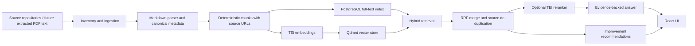

# Elastic Repo Inventory

Elastic Repo Inventory is a local-first search and recommendation tool for selected Elastic documentation repositories. It clones source repos, inventories their structure, ingests Markdown with canonical provenance, generates embeddings, and serves grounded search, answer, and recommendation APIs through FastAPI and a React UI.

## Quick Start

Prerequisites:

- Docker Desktop with Compose
- Git
- Python 3.12 for local CLI and test runs
- Node.js 22 for frontend development outside Docker

Start the full local stack:

```powershell
docker compose up -d --build
```

Open the app:

- Frontend: http://localhost:5173
- API health: http://localhost:8000/api/v1/health
- Qdrant: http://localhost:6333
- Prometheus: http://localhost:9090

From the UI, click **Sync & index changes** to clone or update the configured source repositories and index new or changed Markdown chunks. The first run indexes available content. Later runs compare deterministic chunk IDs and stored content, then embed only new or changed chunks.

The reranker model is optional in local development because it can reserve several GiB of memory while ingestion only needs the embedding model. Enable it when needed:

```powershell
$env:TEI_RERANK_URL="http://tei-rerank/rerank"
docker compose --profile rerank up -d
docker compose up -d --force-recreate api
```

The local reranker profile uses conservative request and batch limits by default. Override `TEI_RERANK_MAX_CONCURRENT_REQUESTS`, `TEI_RERANK_MAX_BATCH_REQUESTS`, or `TEI_RERANK_TOKENIZATION_WORKERS` only if the machine has enough spare CPU and memory.

## Inventory CLI

The repository inventory CLI writes deterministic artifacts for the configured Elastic repos:

```powershell
python tools/repo_inventory.py
```

Outputs:

- `sources/` for cloned repositories
- `artifacts/repo-manifest.json`
- `artifacts/repo-manifest.md`

Useful options:

```powershell
python tools/repo_inventory.py --skip-update
python tools/repo_inventory.py --sources-dir C:\tmp\sources --artifacts-dir C:\tmp\artifacts
```

## Architecture

The application is built as a provenance-first retrieval pipeline: source material is normalized into deterministic chunks, each chunk keeps its canonical source metadata, and every answer or recommendation is assembled from ranked evidence rather than free-floating generated text. The current implementation ingests Markdown from the configured Elastic repositories. If PDF support is added later, a PDF adapter should first extract text and page-level provenance, then pass that normalized content into the same document and chunk model instead of bypassing the existing metadata rules.

For the example query `When should I use reranking after hybrid retrieval?`, the flow is:

1. `tools/repo_inventory.py` and `backend/app/ingest/indexer.py` clone or update `elastic/docs-content`, `elastic/elasticsearch-labs`, and `elastic/labs-releases` under `sources/`.
2. `backend/app/ingest/parser.py` parses Markdown frontmatter and headings; `backend/app/ingest/chunker.py` creates stable anchors and deterministic chunk IDs from `repo:path:anchor:chunk_index`.
3. `backend/app/ingest/license.py` records the source license family, while each chunk stores repo, path, commit SHA, canonical source URL, content type, heading path, and license metadata.
4. Chunk text is stored in PostgreSQL for lexical full-text search, and embeddings from `backend/app/embeddings/client.py` are upserted into Qdrant through `backend/app/vector/qdrant_client.py`.
5. `backend/app/retrieval/service.py` runs PostgreSQL full-text search and dense vector search, merges candidates with reciprocal rank fusion, de-duplicates overlapping source pages, and optionally calls the TEI reranker when `TEI_RERANK_URL` is configured.
6. `backend/app/api/search.py` returns evidence-backed search and answer responses with direct source attributions; `backend/app/recommend/service.py` groups improvement suggestions into relevance, ingestion, mapping, performance, and resiliency categories.
7. `frontend/src` presents the ranked results, synthesized answer, source links, filters, and incremental indexing control in the React UI.



In practice, the query `When should I use reranking after hybrid retrieval?` should retrieve broad BM25 and semantic candidates first, then use reranking only on the smaller merged candidate set when better ordering is worth the extra latency and memory. The UI should show both the answer and the specific documentation or lab sources that support it.

## Source Attribution And Licensing

Every indexed chunk must retain:

- source repository slug
- repository URL
- relative path
- commit SHA
- canonical source URL
- content type
- license family

Answers and recommendations must include direct source links. Do not merge evidence from different repositories without preserving each source URL and license family. New ingestion code should treat provenance metadata as required data, not optional display text.

## Deterministic Evaluation

Chunk IDs are generated from:

```python
sha256(f"{repo}:{path}:{anchor}:{chunk_index}".encode()).hexdigest()
```

Evaluation runs should use pinned queries, deterministic ordering, and stable metric implementations. Current metrics include NDCG@10, MRR@10, and Recall@20.

Run backend tests:

```powershell
python -m pytest -p no:cacheprovider
```

Run frontend build:

```powershell
cd frontend
npm install
npm run build
```

Validate Docker Compose:

```powershell
docker compose config --quiet
```
