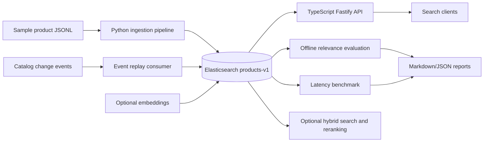

# Elasticsearch Product Search Lab

A compact application-facing Elasticsearch product-search lab that demonstrates catalog ingestion, deterministic document updates, BM25 and hybrid retrieval, offline relevance evaluation, and local latency benchmarking.

## Why This Project Exists

Product search sits at the intersection of relevance, data modeling, ingestion reliability, and runtime performance. This repo is built as a portfolio-grade lab so a reviewer can inspect the search architecture, run it locally, and see how relevance and latency are measured instead of guessed.

This is an educational search-engineering project. It is intentionally smaller than a production marketplace backend, but it includes the practical pieces that make product search credible: mappings, ingestion, query tuning, evaluation, API behavior, and resilience notes.

## Architecture



## Quickstart

Start Elasticsearch and Kibana:

```powershell
docker compose up -d
```

Create the product index and load sample data:

```powershell
.\.venv\Scripts\python.exe scripts\create_index.py --recreate
.\.venv\Scripts\python.exe scripts\load_sample_data.py
```

Start the API:

```powershell
cd apps/api
npm install
npm run dev
```

Run a search from another terminal:

```powershell
curl "http://localhost:3000/search?q=wireless%20mouse&availability=in_stock&debug=true"
```

Run offline relevance evaluation:

```powershell
cd ..\..
.\.venv\Scripts\python.exe scripts\evaluate_search.py
```

Run local latency benchmarking:

```powershell
.\.venv\Scripts\python.exe scripts\benchmark_search.py
```

## Example Evaluation Output

| Query | Precision@10 | MRR | nDCG@10 | Top Result |
| --- | ---: | ---: | ---: | --- |
| wireless mouse | 1.000 | 1.000 | 0.713 | P100008 |
| usb c charger | 1.000 | 1.000 | 0.713 | P100018 |
| espresso machine | 1.000 | 1.000 | 0.787 | P100017 |
| noise cancelling headphones | 0.000 | 0.000 | 0.000 | none |

The full sample report is in `examples/relevance_report.md`. The point is not that the sample catalog is perfect; the point is that relevance changes can be measured per query and in aggregate.

## What This Demonstrates

- Elasticsearch product mappings for IDs, text fields, facets, prices, source versions, timestamps, and dense vectors.
- Deterministic document IDs with `_id = product_id`.
- Bulk ingestion with validation, retry, exponential backoff, and jitter.
- Catalog update events that merge multiple source systems into one product document.
- Stale event protection using `source_versions[source_system]`.
- BM25 query tuning with explicit field boosts.
- Filters versus scoring decisions for availability, brand, category, and price.
- Optional hybrid search with local 384-dimensional embeddings.
- Optional reranking workflow over a bounded candidate window.
- Offline relevance metrics: Precision@k, MRR, DCG, and nDCG@k.
- Latency metrics: p50, p95, p99, min, max, error rate, and timeout rate.
- API resilience basics: request timeouts, safe errors, structured logs, and no stack traces to clients.

## What This Is Not

- Not a production marketplace backend.
- Not a full Kafka deployment.
- Not a full A/B testing platform.
- Not a managed cloud Elasticsearch architecture.
- Not a claim that the placeholder reranker is a real ML reranker.

## Main Commands

```powershell
# Runtime
docker compose up -d
docker compose down

# Index and data
.\.venv\Scripts\python.exe scripts\create_index.py --recreate
.\.venv\Scripts\python.exe scripts\load_sample_data.py
.\.venv\Scripts\python.exe scripts\replay_product_events.py

# Evaluation and benchmarking
.\.venv\Scripts\python.exe scripts\evaluate_search.py
.\.venv\Scripts\python.exe scripts\benchmark_search.py
.\.venv\Scripts\python.exe scripts\evaluate_hybrid_search.py
.\.venv\Scripts\python.exe scripts\evaluate_reranking.py

# API
cd apps/api
npm test
npm run dev
```

## Optional Amazon ESCI Dataset

The lab can prepare a small local sample from the public Amazon ESCI product-search dataset. ESCI provides query-product pairs with Exact, Substitute, Complement, and Irrelevant labels, which makes it useful for product search relevance evaluation.

The full dataset is not committed because it is large raw benchmark data. Download it separately and keep it under `data/raw/`, which is ignored by Git.

```powershell
.\.venv\Scripts\python.exe -m pip install -e ".[esci]"
.\.venv\Scripts\python.exe scripts\prepare_esci_sample.py `
  --products data\raw\esci\shopping_queries_dataset_products.parquet `
  --examples data\raw\esci\shopping_queries_dataset_examples.parquet
.\.venv\Scripts\python.exe scripts\load_sample_data.py --input data\generated\esci_products.jsonl
.\.venv\Scripts\python.exe scripts\evaluate_search.py --judgments data\generated\esci_judgments.jsonl
```

See `docs/esci_dataset.md` for details.

## Optional Hybrid Search

Hybrid search can generate local 384-dimensional product embeddings and compare lexical, boosted lexical, and vector-fused retrieval. It does not require paid APIs or cloud credentials.

```powershell
.\.venv\Scripts\python.exe -m pip install -e ".[vector]"
.\.venv\Scripts\python.exe scripts\generate_embeddings.py --input data\sample\products.jsonl
.\.venv\Scripts\python.exe scripts\evaluate_hybrid_search.py
```

If `sentence-transformers` is not installed, the scripts use deterministic hash embeddings as a lightweight local fallback. See `docs/hybrid_search.md` for tradeoffs.

## Advanced: Reranking

Reranking is available as an optional advanced workflow after baseline and hybrid retrieval. It demonstrates retrieving a broader candidate set, reranking a smaller window, and measuring both relevance improvement and latency cost.

The local reranker is a deterministic text-similarity placeholder for workflow testing. It is not a real ML reranker and is not required for the MVP.

```powershell
.\.venv\Scripts\python.exe scripts\evaluate_reranking.py
```

See `docs/reranking.md` for the tradeoffs and the future path for wiring semantic reranking.


## Continuous Integration

GitHub Actions runs API tests/build and Python unit tests on every push and pull request. CI intentionally does not start Docker or require Elasticsearch.

Python tests that need local services should be marked as integration tests:

```python
import pytest

@pytest.mark.integration
def test_requires_elasticsearch():
    ...
```

Run the default unit-test suite locally with:

```powershell
.\.venv\Scripts\python.exe -m pytest tests/python -m "not integration"
```

Run integration tests locally after starting Elasticsearch:

```powershell
docker compose up -d
.\.venv\Scripts\python.exe -m pytest tests/python -m integration
```

## Next Improvements

- Kafka or Redpanda integration for real event streaming.
- gRPC search service for a stricter service boundary.
- React dashboard for query debugging and evaluation reports.
- Elasticsearch `rank_eval` export from the judgment set.
- `semantic_text` workflow for managed semantic retrieval experiments.
- Real DataDog dashboard mapping for latency, errors, queue pressure, and cluster health.

## Tech Stack

- Elasticsearch 9.3.0 and Kibana 9.3.0
- Docker Compose
- Python for ingestion, evaluation, embeddings, and benchmarks
- TypeScript, Node.js, and Fastify for the search API
- Vitest and pytest for automated tests

## Portfolio Note

This is an educational/search-engineering lab, not a production marketplace backend. It is designed to demonstrate applied search-engineering thinking in a compact codebase that can be reviewed quickly.
