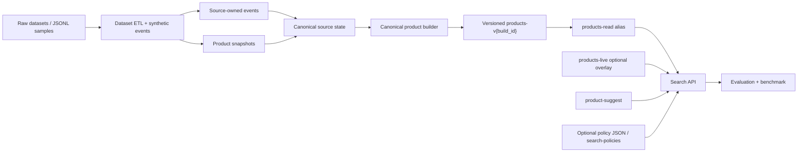
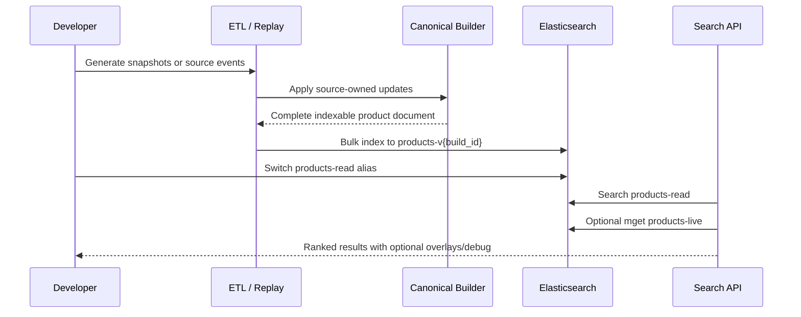

# Architecture Overview

## Components

The stable product-search index is built from complete canonical product documents. Source systems own fields separately: catalog, price, inventory, reviews, and analytics. The builder merges source state before indexing so Elasticsearch does not become the business-merge layer.

## Sequence

## Review Guide

- Ingestion contracts: `src/ingestion/canonical_types.py`, `src/ingestion/source_state.py`, `src/ingestion/canonical_builder.py`
- Kafka-compatible optional path: `src/ingestion/kafka_consumer.py`
- Versioned indexing and aliases: `src/search/index_management.py`
- API read path: `apps/api/src/search/*`
- Dataset adapters: `scripts/prepare_*_sample.py`
- Governance policies: `apps/api/src/search/policies.ts`

## What Stays Optional

Kafka, live overlays, suggest, dataset adapters, and governance policies are optional layers. The local JSONL path still works with Elasticsearch and small checked-in sample files.
